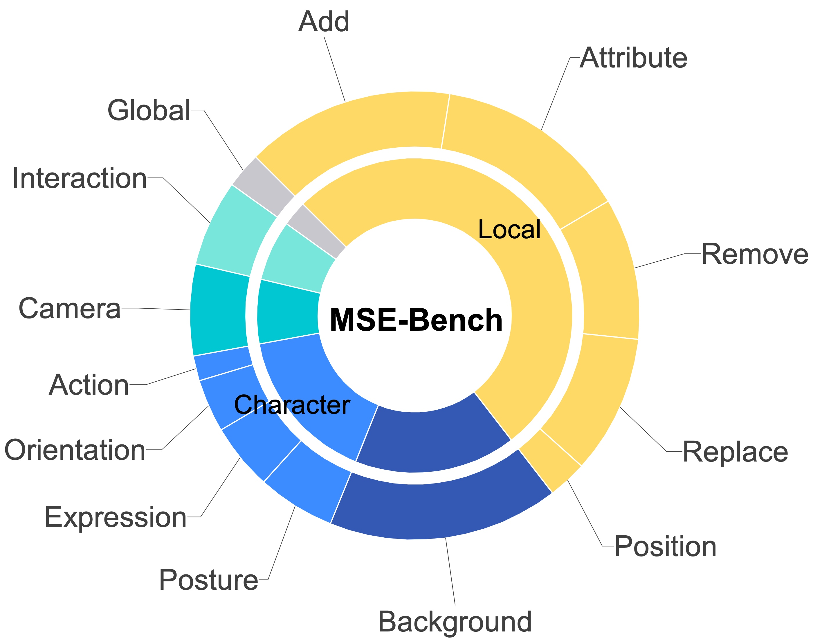
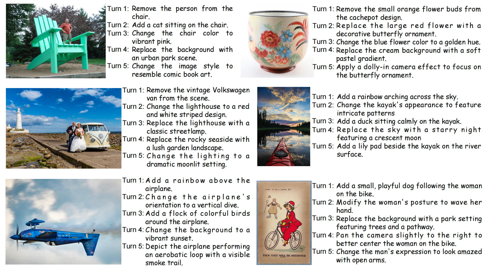

# MSE-Bench

Existing benchmarks , such as [MagicBrush](https://osu-nlp-group.github.io/MagicBrush/), are constrained to basic editing operations, such as addition, replacement, removal, attribute modification, and background changes, and thus fall short of meeting practical user needs. Moreover, MagicBrush supports only up to three editing turns per session, with each turn treated in isolation, further diverging from real-world editing workflows. To address these limitations,
“others” includes expression, orientation, position, global, and action change.
we propose MSE-Bench (Multi-turn Session image
Editing Benchmark), which comprises 100 test instances, each featuring a coherent five-turn editing
session. MSE-Bench expands the range of editing
categories to include more complex and realistic
scenarios such as posture adjustment, object interaction, and camera view changes, as shown in the following figure.
To better reflect user intent and practical applications, we also incorporate aesthetic considerations
into the construction of each editing instruction, encouraging progressive visual enhancement across
turns.

## Benchmark Construction
The source images for our constructed multi-turn image editing benchmark, MSE-Bench, are sampled
from [MS-COCO](https://cocodataset.org/) and [LAION-Aesthetics](https://laion.ai/blog/laion-aesthetics/). Specifically, we randomly sample XXX images
from each dataset and employ GPT-4o to perform prompt imagination, guided by criteria such
as editing reasonability, aesthetics, consistency, and coherence. To facilitate this, we define a set
of editing operations (e.g., add, remove, replace) and design a series of rules to instruct GPT-4o
to simulate realistic and coherent multi-turn editing prompts from real users’ perspectives. The
instruction used in this process is illustrated above. Following prompt generation, we conduct
careful human filtering to remove low-quality cases, resulting in a final set of 100 high-quality,
category-balanced examples that constitute MSE-Bench.

