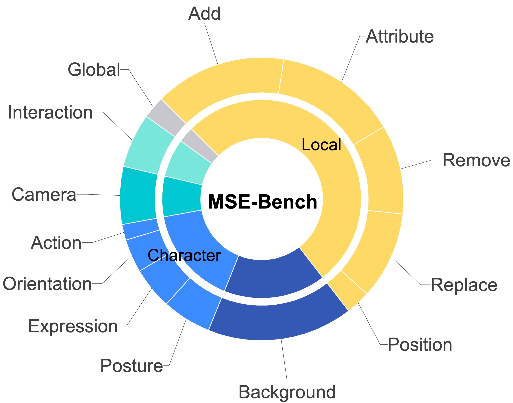
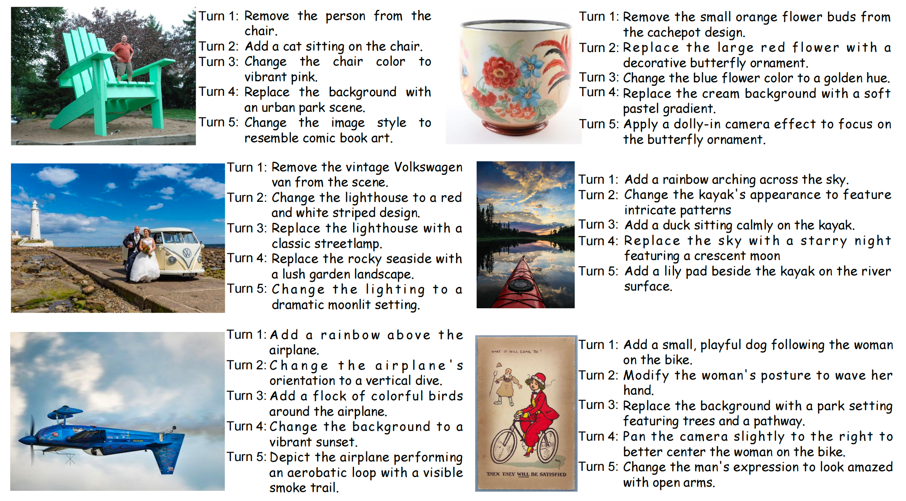

# MSE-Bench

Existing benchmarks , such as [MagicBrush](https://osu-nlp-group.github.io/MagicBrush/), are constrained to basic editing operations, such as addition, replacement, removal, attribute modification, and background changes, and thus fall short of meeting practical user needs. Moreover, MagicBrush supports only up to three editing turns per session, with each turn treated in isolation, further diverging from real-world editing workflows. To address these limitations,
“others” includes expression, orientation, position, global, and action change.
we propose MSE-Bench (Multi-turn Session image
Editing Benchmark), which comprises 100 test instances, each featuring a coherent five-turn editing
session. MSE-Bench expands the range of editing
categories to include more complex and realistic
scenarios such as posture adjustment, object interaction, and camera view changes, as shown in the following figure.
To better reflect user intent and practical applications, we also incorporate aesthetic considerations
into the construction of each editing instruction, encouraging progressive visual enhancement across
turns.

<p align="center"></p>


## Benchmark Construction
The source images for our constructed multi-turn image editing benchmark, MSE-Bench, are sampled
from [MS-COCO](https://cocodataset.org/) and [LAION-Aesthetics](https://laion.ai/blog/laion-aesthetics/). Specifically, we randomly sample XXX images
from each dataset and employ GPT-4o to perform prompt imagination, guided by criteria such
as editing reasonability, aesthetics, consistency, and coherence. To facilitate this, we define a set
of editing operations (e.g., add, remove, replace) and design a series of rules to instruct GPT-4o
to simulate realistic and coherent multi-turn editing prompts from real users’ perspectives. The
instruction used in this process is illustrated above. Following prompt generation, we conduct
careful human filtering to remove low-quality cases, resulting in a final set of 100 high-quality,
category-balanced examples that constitute MSE-Bench.

<p align="center"></p>

## Benchmark Structure

The benchmark is composed of samples, each containing a source image and a rich set of information.

Each sample has the following features:

*   `image`: The source image to be edited.
*   `index`: A unique integer ID for each sample.
*   `summary`: A high-level string describing the overall goal of the editing process.
*   `description_source`: A string containing a detailed caption of the original source image.
*   `context`: A list of strings, where each string is a prompt for a single editing turn. **This `context` field is designed to be used as the direct input to a multi-turn editing model**, with each element in the list corresponding to a sequential step in the editing process.
*   `operation`: A list of strings categorizing the type of edit for each corresponding prompt in the `context`. This provides a structured way to analyze model performance across different editing capabilities (e.g., `object_replace`, `attribute_change`, `add`, `remove`, `background_replace`, `orientation`, etc.).
*   `description_target`: A list of strings describing the expected outcome after each editing turn. This can be used for evaluation, comparing the model's generated image at each step against the target description.


### Example

Here is an example of one data sample (excluding the image):

```json
{
  "index": 0,
  "summary": "The aim is to enhance the snowman's whimsical appearance through a series of diverse editing operations that introduce new elements, modify existing attributes, and alter perspectives to create a more interesting and visually appealing scene.",
  "description_source": "The image features a cheerful snowman with a carrot nose, smiling face, and eyes made of coal. It is adorned with a brown top hat and a patterned scarf with green and orange decorations matching its gloves. The snowman is set against a plain white background, showcasing its simple and whimsical design.",
  "context": [
    "Replace the snowman's top hat with a red Santa hat.",
    "Change the color of the snowman's scarf to red and white stripes.",
    "Remove the snowman's left mitten to reveal a twig hand holding a candy cane.",
    "Replace the background with a snowy forest scene.",
    "Adjust the snowman's orientation to face slightly towards the right."
  ],
  "operation": [
    "object_replace",
    "attribute_change",
    "remove",
    "background_replace",
    "orientation"
  ],
  "description_target": [
    "The snowman retains its smile but now has a Santa hat adorned with a white pom-pom, adding a festive holiday touch.",
    "The snowman's scarf color is now changed to a vibrant red and white stripe pattern, providing a more contrasting and lively visual.",
    "The snowman's left mitten is removed, revealing a twig-like hand holding a candy cane, adding a playful element.",
    "The snowman is now positioned in a snowy forest backdrop with spruce trees, lending a natural winter setting to the image.",
    "The snowman is turned slightly to the right, as if facing towards a nearby bird perched on its twig arm, inviting a sense of interaction."
  ]
}
```

## How to Use

You can easily load and use the MSE-Bench dataset using the `datasets` library.

First, install the library:
```bash
pip install datasets
```

Then, load the dataset in your Python script:
```python
from datasets import load_dataset

# Load the dataset
dataset = load_dataset("leigangqu/MSE-Bench")

# Access the training split
train_dataset = dataset["train"]

# Iterate through the first few examples
for i in range(5):
    example = train_dataset[i]
    print(f"--- Example {example['index']} ---")
    print(f"Source Image: {example['image']}")
    print(f"Summary: {example['summary']}")
    print("Editing Context:")
    for turn, prompt in enumerate(example['context']):
        print(f"  Turn {turn+1}: {prompt} ({example['operation'][turn]})")
    print("-" * 20)

```